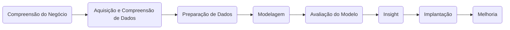
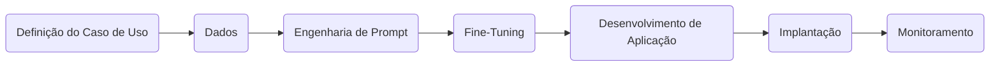

Com certeza! Abaixo está o conteúdo completo da apresentação "The AI_ML Landscape", formatado em Markdown e com os gráficos convertidos para o padrão Mermaid, conforme solicitado.

---

# O Cenário de IA/ML: Arquitetura de Soluções de IA

## Visão Geral do Curso
Esta seção oferece uma visão geral do curso, "O Cenário de IA/ML", com foco em Arquitetura de Soluções de IA, apresentado por Faisal Nazir.

### Tópicos do Syllabus
O curso abrange os seguintes tópicos principais:
*   01: O Cenário de IA/ML
*   02: Visão Geral de Operações de Machine Learning (MLOps)
*   03: Engenharia de Dados
*   04: Conceitos de Machine Learning: Regressão
*   05: Conceitos de Machine Learning: Classificação & Agrupamento
*   06: Treinamento, Ajuste e Implantação de Modelos
*   07: Fundamentos de Deep Learning e Aprendizado por Reforço
*   08: Técnicas Avançadas de Deep Learning
*   09: IA Generativa: Conceitos e Uso Básico
*   10: IA Generativa: Engenharia de Prompt e Multi-Agentes de IA
*   11: Visualização & Aplicação
*   12: IA em Escala & Pipelines Avançados
*   13: O Estado da Arte em IA
*   14: IA Explicável (xAI)
*   15: Serviços de Nuvem para IA/ML
*   16: Tornando-se um Arquiteto de IA de Sucesso

### Agenda da Aula
A agenda desta lição inclui:
*   01: Resolução de Problemas com IA/ML: Regressão, Classificação, Otimização de Processos
*   02: Ciclo de Vida do Projeto de IA/ML
*   03: Papéis & Duração do Projeto
*   04: Arquiteto de IA/ML vs. Arquiteto de IA Generativa
*   05: Projetos de IA Generativa: Introdução

### Regras de Conduta na Aula
Para uma aula produtiva, por favor:
*   **Mantenha a câmera ligada** durante a aula.
*   **Silencie seu microfone** para não interromper o instrutor acidentalmente.
*   **Use o recurso "Levantar a mão" no Zoom** se quiser fazer uma pergunta.
*   **Não se esqueça de abaixar a mão** depois de terminar.
    *   *Certifique-se de atualizar o Zoom para usar este recurso.*
*   Use o recurso "Q&A" no Zoom se quiser fazer uma pergunta.

## O Cenário da Inteligência Artificial (IA/ML)

### Taxonomia da Inteligência Artificial
A Inteligência Artificial abrange diversas subdisciplinas e abordagens, conforme ilustrado abaixo:

```mermaid
graph TD
    A[Inteligência Artificial] --> B(Machine Learning)
    A --> C(Robótica)
    A --> D(Bayesiano)
    A --> E(Sistemas Especialistas)
    A --> F(Linguagem Natural)
    A --> G(Visão)
    A --> H(Representação do Conhecimento)
    A --> I(Algoritmos Genéticos)
    A --> J(Fala)

    B --> B1(Aprendizado Supervisionado)
    B --> B2(Aprendizado Não Supervisionado)
    B --> B3(Aprendizado por Reforço)
    B --> B4(Self-Supervised Learning)
    B --> B5(Deep Learning)

    B1 --> B1a(Regressão)
    B1 --> B1b(Classificação)
    B1 --> B1c(Árvores Impulsionadas por Gradiente (XGBoost))
    B1 --> B1d(Recomendação)

    B2 --> B2a(PCA)
    B2 --> B2b(Detecção de Anomalias)
    B2 --> B2c(Agrupamento)
    B2 --> B2d(Filtragem Colaborativa)

    B3 --> B3a(Otimização de Políticas (PPO))
    B3 --> B3b(Q-Learning)
    B3 --> B3c(Aprendizado por Reforço Profundo)

    B4 --> B4a(Gen-AI)
    B4 --> B4b(Autoencoders)
    B4 --> B4c(GANs)

    B5 --> B5a(CNNs)
    B5 --> B5b(RNNs)
    B5 --> B5c(Transformers)
    B5 --> B5d(Grafo)
```

### Padrões de Inteligência Artificial
Os padrões de Inteligência Artificial ramificam-se em várias áreas de aplicação e técnicas:

```mermaid
graph TD
    AI_Patterns[Padrões de Inteligência Artificial] --> NL_Understanding(Compreensão de Linguagem Natural)
    AI_Patterns --> Robotics(Robótica e Automação)
    AI_Patterns --> Structured_Data(Dados Estruturados)
    AI_Patterns --> Recommender_Systems(Sistemas de Recomendação)
    AI_Patterns --> Computer_Vision(Visão Computacional)
    AI_Patterns --> Generative_Systems(Sistemas Generativos)

    NL_Understanding --> C_AI(IA Conversacional)
    NL_Understanding --> CC_Intelligence(Inteligência do Contact Center)
    NL_Understanding --> Chatbots(Chatbots)
    NL_Understanding --> ASR(Reconhecimento Automático de Fala)
    NL_Understanding --> Translation(Tradução)
    NL_Understanding --> Sentiment(Análise de Sentimento)

    Robotics --> RL(Aprendizado por Reforço)
    Robotics --> Sensing(Sensoriamento)
    Robotics --> Actuation(Atuação)
    Robotics --> CLC(Controle de Loop Fechado)
    Robotics --> AD(Condução Autônoma)
    Robotics --> Optimisation(Otimização)

    Structured_Data --> Regression(Regressão)
    Structured_Data --> Classification(Classificação)
    Structured_Data --> Clustering(Agrupamento)
    Structured_Data --> Time_Series(Séries Temporais)
    Structured_Data --> Forecasting(Previsão)
    Structured_Data --> Multivariate_Analysis(Análise Multivariada)

    Recommender_Systems --> Personalisation(Personalização)
    Recommender_Systems --> Segmentation(Segmentação)
    Recommender_Systems --> Hyper_Personalisation(Hiper-Personalização)
    Recommender_Systems --> Subtopic4(Subtópico 4)

    Computer_Vision --> OD(Detecção de Objetos)
    Computer_Vision --> FR(Reconhecimento Facial)
    Computer_Vision --> OR(Reconhecimento de Objeto)
    Computer_Vision --> Biometrics(Biometria)
    Computer_Vision --> IDP(Processamento Inteligente de Documentos)
    Computer_Vision --> SS(Segmentação Semântica)
    Computer_Vision --> FDM(Detecção e Monitoramento de Falhas)

    Generative_Systems --> L_L_Models(Grandes Modelos de Linguagem)
    Generative_Systems --> Diffusion_Models(Modelos de Difusão)
    Generative_Systems --> GANs(Redes Generativas Adversariais)

    L_L_Models --> DS(Resumo de Documentos)
    L_L_Models --> QA_Assistant(Assistente de Perguntas e Respostas)
    L_L_Models --> KB_Q_A(Perguntas e Respostas Baseadas em Conhecimento)
    L_L_Models --> SEM_EMB_S(Incorporação Semântica e Busca)
    L_L_Models --> Reasoning(Raciocínio)
    L_L_Models --> Prompt_Eng(Engenharia de Prompt)
    L_L_Models --> Multi_Agents(Multi-Agentes)

    Diffusion_Models --> T_V(Texto para Vídeo)
    Diffusion_Models --> T_I(Texto para Imagem)
    Diffusion_Models --> I_G(Geração de Imagem)
    Diffusion_Models --> V_T(Vídeo para Texto)
    Diffusion_Models --> Multi_Modal(Multi-modal)

    GANs --> SR(Super-resolução)
    GANs --> SDG(Geração de Dados Sintéticos)
    GANs --> I_I_STS(Imagem para Imagem (Transferência de Estilo))
    GANs --> Denoising(Remoção de Ruído)
```

## Método Clássico de IA/ML
O método clássico de ciência de dados segue um fluxo de trabalho estruturado para o desenvolvimento e implantação de modelos de IA/ML.

### Fluxo Principal do Método Clássico de IA/ML



### Detalhamento das Etapas do Método Clássico de IA/ML

#### 1. Compreensão do Negócio (Framing)
Esta etapa envolve a definição do problema e dos objetivos:
*   **Meta Estratégica:**
    *   Definir objetivos de negócio claros e critérios de sucesso.
    *   Identificar indicadores chave de desempenho (KPIs).
    *   Alinhar o projeto de dados com a estratégia organizacional.
*   **Partes Interessadas:**
    *   Mapear todas as unidades de negócio e tomadores de decisão afetados.
    *   Estabelecer canais de comunicação e cadência de relatórios.
    *   Documentar expectativas e restrições das partes interessadas.
*   **Formular a Pergunta em Linguagem Simples:**
    *   Traduzir problemas de negócio em perguntas analíticas solucionáveis.
    *   Validar a declaração do problema com especialistas no assunto.
    *   Criar um glossário de termos de negócio e técnicos.

#### 2. Traduzir para a Tarefa de ML
Esta sub-etapa da "Compreensão do Negócio" visa converter o problema de negócio em uma tarefa técnica de Machine Learning:
*   **Devo Prever um Número?**
    *   Considerar necessidades de previsão de séries temporais.
    *   Avaliar requisitos de intervalo de previsão.
*   **Devo Categorizar?**
    *   Avaliar o tipo de classificação (binária, multiclasse, multi-rótulo).
    *   Considerar desafios de distribuição de classes desequilibradas.
    *   Determinar requisitos de limite de probabilidade.
*   **Que Estrutura Estou Tentando Descobrir?**
    *   Avaliar necessidades de agrupamento, redução de dimensionalidade.
    *   Considerar requisitos de detecção de anomalias.
    *   Avaliar objetivos de descoberta de relacionamento.
*   **Qual é Minha Métrica de Sucesso?**
    *   Definir métricas de avaliação técnica.
    *   Vincular métricas ao valor de negócio.
    *   Estabelecer expectativas de desempenho de linha de base.

#### 3. Aquisição e Compreensão de Dados (Preparação de Dados)
Esta etapa foca na coleta e exploração dos dados:
*   **Adquirir os Dados:**
    *   Identificar todas as fontes de dados relevantes (internas/externas).
    *   Estabelecer protocolos e permissões de acesso a dados.
    *   Documentar linhagem e proveniência dos dados.
    *   Criar pipelines de dados reproduzíveis.
*   **Visualizar os Dados:**
    *   Gerar visualizações exploratórias iniciais.
    *   Identificar padrões, *outliers* e distribuições.
    *   Criar matrizes de correlação e mapas de relacionamento.
    *   Validar suposições com especialistas no domínio.

#### 4. Tamanho da Amostra e Trade-off entre Viés e Variância
Ainda na "Aquisição e Compreensão de Dados", considerações importantes sobre os dados:
*   **Tamanho da Amostra?**
    *   Calcular requisitos de poder estatístico.
    *   Avaliar necessidades de volume de dados para confiabilidade do modelo.
    *   Considerar abordagens de amostragem estratificada.
    *   Avaliar requisitos de período de tempo para dados temporais.
*   **Viés – Trade-off entre Viés e Variância:**
    *   Identificar potenciais fontes de viés na coleta de dados.
    *   Documentar problemas de representatividade dos dados.
    *   Planejar estratégias de mitigação de viés.
    *   Equilibrar a complexidade do modelo contra o risco de *overfitting*.

#### 5. Preparação de Dados
Esta etapa abrange a limpeza e transformação dos dados:
*   **Limpar os Dados:**
    *   Padronizar formatos e codificações.
    *   Lidar com duplicatas e inconsistências.
    *   Abordar sistematicamente problemas de qualidade de dados.
    *   Documentar todas as transformações para reprodutibilidade.
*   **Preencher Dados Faltantes (Imputação):**
    *   Analisar padrões de dados faltantes (MCAR, MAR, MNAR).
    *   Selecionar métodos de imputação apropriados.
    *   Validar o impacto da imputação nas distribuições.
    *   Considerar múltiplas técnicas de imputação para incerteza.

#### 6. Engenharia de Features e Divisão de Dados
Continuação da "Preparação de Dados", focando na criação e organização de variáveis:
*   **Engenharia de Features:**
    *   Criar *features* específicas do domínio.
    *   Transformar variáveis para melhor desempenho do modelo.
    *   Gerar termos de interação e *features* polinomiais.
    *   Aplicar técnicas de redução de dimensionalidade.
*   **Divisão de Dados de Treinamento/Teste:**
    *   Implementar estratégia de validação cruzada.
    *   Garantir coerência temporal para séries temporais.
    *   Considerar divisão estratificada para dados desequilibrados.
    *   Criar conjuntos de validação *holdout*.

#### 7. Modelagem
Esta etapa envolve a seleção, treinamento e ajuste do modelo:
*   **Seleção do Modelo:**
    *   Avaliar a adequação do algoritmo ao tipo de problema.
    *   Considerar requisitos de interpretabilidade do modelo.
    *   Avaliar restrições computacionais e de implantação.
    *   Comparar múltiplas abordagens de modelo.
*   **Treinar Modelo:**
    *   Implementar *pipeline* para treinamento reproduzível.
    *   Documentar hiperparâmetros e *seeds* aleatórias.
    *   Monitorar o progresso do treinamento e a convergência.
    *   Implementar mecanismos de parada antecipada.

#### 8. Ajustar Modelo
Parte da etapa de "Modelagem", refinando o desempenho do modelo:
*   Conduzir otimização sistemática de hiperparâmetros.
*   Implementar abordagens de regularização.
*   Avaliar a importância e seleção de *features*.
*   Aplicar métodos de *ensemble* quando apropriado.

#### 9. Avaliação do Modelo
Esta etapa foca na validação do desempenho e da robustez do modelo:
*   **Comparar Métricas com os KPIs Alvo:**
    *   Avaliar a adequação do algoritmo ao tipo de problema.
    *   Considerar requisitos de interpretabilidade do modelo.
    *   Avaliar restrições computacionais e de implantação.
    *   Comparar múltiplas abordagens de modelo.
*   **Análise de Erro & Verificações de Imparcialidade:**
    *   Analisar padrões de erro em subgrupos.
    *   Implementar métricas e restrições de imparcialidade.
    *   Testar impacto desproporcional em classes protegidas.
    *   Documentar *trade-offs* de imparcialidade e mitigações.

#### 10. Testes de Sensibilidade e Robustez
Continuação da "Avaliação do Modelo", assegurando a estabilidade do modelo:
*   Validar a estabilidade do modelo em perturbações de dados.
*   Testar o modelo sob condições adversárias.
*   Avaliar o desempenho com simulações de *data drift*.
*   Avaliar a confiabilidade sob cenários extremos.

#### 11. Insight
Esta etapa visa traduzir os resultados do modelo em valor de negócio acionável:
*   **Traduzir de Volta para o Problema de Negócio:**
    *   Contextualizar as saídas do modelo em termos de negócio.
    *   Mapear previsões para decisões acionáveis.
    *   Quantificar o impacto no negócio do desempenho do modelo.
    *   Identificar limitações e casos de borda.
*   **Criar a Narrativa para Explicação do Modelo:**
    *   Desenvolver explicações claras para públicos não técnicos.
    *   Criar visualizações do processo de decisão do modelo.
    *   Abordar preocupações de "caixa preta" com técnicas apropriadas.
    *   Documentar suposições e restrições do modelo.

#### 12. Explicar Recomendações Acionáveis
Parte da etapa de "Insight", focando na comunicação das recomendações:
*   Priorizar *insights* por impacto no negócio.
*   Definir limites claros de decisão para ações.
*   Criar roteiros de implementação para recomendações.
*   Desenvolver planos de contingência para casos de borda.

#### 13. Implantação (Deploy)
Esta etapa trata de tornar o modelo disponível para uso:
*   **Empacotar Modelo (API, Batch Job, Embedded Edge):**
    *   Projetar arquitetura de implantação apropriada.
    *   Implementar conteinerização e escalabilidade.
    *   Documentar especificações de API e interfaces.
    *   Criar manuais de implantação e procedimentos.
*   **Monitorar Drift, Latência, Custo, Impacto no Negócio:**
    *   Implementar painéis de monitoramento de modelo.
    *   Estabelecer limites de alerta de desempenho.
    *   Quantificar ROI contínuo e valor de negócio.
    *   Documentar métricas técnicas e de negócio.

#### 14. Acionar Pipeline de Retreinamento Quando os Limites São Violados
Continuação da etapa de "Implantação", garantindo a manutenção do modelo:
*   Criar sistemas de monitoramento automatizados.
*   Definir limites claros de desempenho.
*   Implementar protocolos de degradação graciosa.
*   Documentar procedimentos de escalonamento.

#### 15. Melhoria (Improve)
A etapa final e contínua do ciclo de vida, focada na otimização do modelo:
*   **Coletar Novos Dados:**
    *   Implementar *loops* de feedback para melhoria do modelo.
    *   Projetar experimentos para coleta de dados direcionada.
    *   Estabelecer sistemas de monitoramento de qualidade de dados.
    *   Criar processos para captura de casos de borda.
*   **Executar Novamente o Treinamento Conforme Necessário ou se o Modelo Falhar no Desempenho:**
    *   Definir gatilhos e cronograma de retreinamento.
    *   Implementar portas de validação automatizadas.
    *   Documentar controle de versão para modelos.
    *   Criar uma estrutura de teste A/B para versões de modelo.

## Método de IA Generativa (Gen AI)
O Método de IA Generativa segue um fluxo de trabalho otimizado para o desenvolvimento de soluções de IA Generativa.

### Fluxo Principal do Método de IA Generativa



### Detalhamento das Etapas do Método de IA Generativa

#### 1. Definição do Caso de Uso
Esta etapa inicial avalia a aplicabilidade e viabilidade da IA Generativa:
*   **Qual é o Problema?**
    *   Definir desafios de negócio específicos a serem abordados.
    *   Identificar pontos problemáticos nos processos atuais.
    *   Estabelecer objetivos claros e resultados esperados.
    *   Determinar como o sucesso será medido.
*   **Quais São os Dados?**
    *   Inventariar fontes e formatos de dados disponíveis.
    *   Avaliar a qualidade, frescor e acessibilidade dos dados.
    *   Identificar bases de conhecimento proprietárias e documentação.
    *   Determinar requisitos de privacidade e conformidade de dados.
*   **A IA Generativa é Útil?**
    *   Avaliar se o problema requer capacidades generativas.
    *   Comparar com abordagens tradicionais de ML.
    *   Avaliar o ROI potencial da solução de IA generativa.
    *   Considerar implicações éticas e riscos potenciais.

#### 2. Design
Esta etapa abrange decisões arquitetônicas e estratégicas para o modelo:
*   **Incorporação de Dados no Modelo — Fine-Tuning:**
    *   Selecionar modelos de incorporação apropriados.
    *   Projetar estratégias de *chunking* de documentos.
    *   Implementar soluções de armazenamento vetorial.
    *   Determinar ciclos de atualização de incorporação.
*   **Frontier vs. Código Aberto:**
    *   Comparar capacidades de modelos proprietários vs. modelos de código aberto.
    *   Avaliar implicações de custo de cada abordagem.
    *   Avaliar *trade-offs* de desempenho.
    *   Considerar requisitos de conformidade e privacidade de dados.
*   **Aprendizado em Contexto vs. Fine-Tuning:**
    *   Projetar modelos de prompt eficazes para aprendizado em contexto.
    *   Determinar quando o *fine-tuning* é necessário.
    *   Avaliar o custo-benefício de cada abordagem.
    *   Criar estratégias híbridas quando apropriado.
*   **Custo – Custo por Invocação vs. Hospedar Seu Próprio Modelo:**
    *   Calcular o custo total de propriedade para diferentes abordagens.
    *   Avaliar os requisitos de infraestrutura para auto-hospedagem.
    *   Projetar padrões de uso e custos associados.
    *   Implementar estratégias de otimização de custos.
*   **Agentes:**
    *   Projetar arquitetura e coordenação de agentes.
    *   Implementar componentes de planejamento e raciocínio.
    *   Criar capacidades de uso de ferramentas.
    *   Estabelecer gerenciamento de memória e contexto de agentes.
*   **Raciocínio:**
    *   Implementar técnicas de cadeia de pensamento (*chain-of-thought*).
    *   Projetar abordagens de árvore de pensamento (*tree-of-thought*).
    *   Criar *loops* de verificação.
    *   Implementar mecanismos de autocritica.

#### 3. Dados
Esta etapa foca na gestão e recuperação de dados para Gen AI:
*   **Ingestão de Dados:**
    *   Estabelecer *pipelines* de coleta de dados.
    *   Implementar fluxos de trabalho de pré-processamento.
    *   Criar processos de limpeza e padronização de dados.
    *   Documentar esquemas e formatos de dados.
*   **Recuperação de Dados:**
    *   Projetar estratégias de indexação eficientes.
    *   Implementar soluções de banco de dados vetoriais.
    *   Criar sistemas de marcação de metadados.
    *   Estabelecer mecanismos de pontuação de relevância.
*   **Busca de Dados — Geração Aumentada por Recuperação (RAG):**
    *   Implementar capacidades de busca semântica.
    *   Projetar técnicas de otimização de janela de contexto.
    *   Criar estratégias de *chunking* para documentos grandes.
    *   Estabelecer métodos de recuperação híbridos (palavra-chave + semântica).

#### 4. Seleção de Modelo
Escolha e avaliação dos modelos base para a solução de IA Generativa:
*   **Modelo Frontier:**
    *   Avaliar os mais recentes modelos comerciais (GPT-4, Claude, etc.).
    *   Avaliar o desempenho em tarefas específicas do domínio.
    *   Considerar preços e limitações de uso.
    *   Avaliar a confiabilidade da API e acordos de nível de serviço.
*   **Modelo de Código Aberto:**
    *   Comparar os principais modelos de código aberto (Mistral, Llama, etc.).
    *   Avaliar os requisitos de hardware para implantação.
    *   Avaliar o suporte da comunidade e a frequência de atualização.
    *   Considerar as implicações de licenciamento.
*   **Modelo de Incorporação:**
    *   Selecionar dimensões de incorporação apropriadas.
    *   Avaliar modelos de incorporação específicos do domínio.
    *   Avaliar capacidades multilingues, se necessário.
    *   Comparar a qualidade da incorporação e o desempenho da recuperação.
*   **Modelo de Raciocínio:**
    *   Avaliar modelos com fortes capacidades de raciocínio.
    *   Avaliar o desempenho em tarefas de lógica e resolução de problemas.
    *   Considerar arquiteturas de raciocínio especializadas.
    *   Implementar mecanismos de verificação de raciocínio.

#### 5. Engenharia de Prompt
Foco na criação e otimização dos prompts para interagir com os modelos generativos:
*   **Zero-Shot:**
    *   Projetar instruções claras e abrangentes.
    *   Implementar prompts de sistema com definições de função.
    *   Criar especificações de formato para saídas.
    *   Testar a robustez às variações de prompt.
*   **Few-Shot:**
    *   Selecionar exemplos representativos para aprendizado *few-shot*.
    *   Projetar o formato do exemplo para aprendizado ideal.
    *   Determinar o número ótimo de exemplos.
    *   Implementar rotação de exemplos para diversidade.
*   **Chain of Thought (Cadeia de Pensamento):**
    *   Projetar prompts que incentivem o raciocínio passo a passo.
    *   Implementar etapas de verificação dentro das cadeias.
    *   Criar lógica de ramificação para raciocínio complexo.
    *   Estabelecer detecção de erro dentro das cadeias de raciocínio.
*   **Múltiplas Técnicas:**
    *   Combinar estratégias de *prompting* complementares.
    *   Implementar testes A/B para técnicas de *prompt*.
    *   Criar *prompting* adaptativo baseado no contexto.
    *   Desenvolver bibliotecas de *prompt* para diferentes casos de uso.

#### 6. Design Agentivo
Desenvolvimento de agentes inteligentes e suas interações:
*   **Desmembrar Tarefas de Trabalho:**
    *   Mapear tarefas complexas em subtarefas discretas.
    *   Criar gráficos de dependência para execução de tarefas.
    *   Implementar lógica de priorização de tarefas.
    *   Projetar mecanismos de recuperação de falhas.
*   **Design de Agentes Especializados:**
    *   Criar agentes específicos para funções com capacidades especializadas.
    *   Implementar protocolos de comunicação entre agentes.
    *   Projetar mecanismos de coordenação de agentes.
    *   Estabelecer hierarquia e supervisão.
*   **Quais Ferramentas?**
    *   Inventariar ferramentas externas e APIs necessárias.
    *   Implementar estruturas de chamada de ferramentas.
    *   Criar documentação de ferramentas para contexto do modelo.
    *   Projetar mecanismos de *fallback* para falhas de ferramentas.
*   **Quais APIs Existem que Posso Usar?**
    *   Catalogar serviços de terceiros relevantes.
    *   Implementar autenticação e limitação de taxa.
    *   Criar *wrappers* de API para chamadas simplificadas.
    *   Projetar estratégias de *caching* para respostas de API.
*   **Qual Framework?**
    *   Avaliar *frameworks* de agentes (LangChain, AutoGPT, etc.).
    *   Avaliar requisitos de *framework* personalizado.
    *   Considerar a integração com sistemas existentes.
    *   Avaliar a maturidade do *framework* e o suporte da comunidade.

#### 7. Fine-Tuning
Refinamento do modelo base com dados específicos:
*   **Opcional:**
    *   Determinar se o desempenho do modelo base é suficiente.
    *   Avaliar o ROI de investimentos em *fine-tuning*.
    *   Considerar abordagens alternativas (RAG, *prompting*).
    *   Avaliar os requisitos de manutenção de modelos com *fine-tuning*.
*   **Tenho Dados Suficientes?**
    *   Calcular o tamanho mínimo viável do conjunto de dados.
    *   Avaliar a qualidade e diversidade dos dados.
    *   Implementar técnicas de aumento de dados, se necessário.
    *   Projetar estratégias de coleta de dados para lacunas.

#### 8. Avaliação e Segurança
Garantia da confiabilidade, segurança e desempenho do modelo:
*   **LLM como Juiz:**
    *   Implementar técnicas de autoavaliação.
    *   Projetar *prompts* de avaliação comparativa.
    *   Criar rubricas de pontuação para saídas do modelo.
    *   Implementar revisão por pares com múltiplos modelos.
*   **Raciocínio Automatizado:**
    *   Projetar validação automatizada de lógica consistente.
    *   Implementar verificação de fatos contra bases de conhecimento.
    *   Criar verificação formal para saídas críticas.
    *   Projetar abordagens automatizadas de *red-teaming*.
*   **Regras Manuais:**
    *   Criar *guardrails* explícitos baseados em regras.
    *   Implementar mecanismos de filtragem de conteúdo.
    *   Projetar taxonomias para conteúdo proibido.
    *   Estabelecer processos de revisão para casos de borda.
*   **Quórum de Modelos:**
    *   Implementar mecanismos de votação entre múltiplos modelos.
    *   Projetar algoritmos de consenso para decisões críticas.
    *   Criar pontuação de confiança baseada no acordo.
    *   Implementar diversidade na seleção de modelos.
*   **Guardrails:**
    *   Projetar mecanismos de segurança abrangentes.
    *   Implementar filtragem de entrada e saída.
    *   Criar detecção de tópicos sensíveis.
    *   Projetar caminhos de escalonamento para casos de borda.
*   **Benchmarks de Desempenho do Modelo:**
    *   Estabelecer métricas de avaliação específicas do domínio.
    *   Implementar testes de *benchmark* regulares.
    *   Criar painéis de desempenho.
    *   Projetar *benchmarking* comparativo contra alternativas.

#### 9. Desenvolvimento de Aplicações
Construção da interface e experiência do usuário:
*   **Construir UI (Interface do Usuário):**
    *   Projetar interfaces de usuário intuitivas para diferentes tipos de usuários.
    *   Implementar mecanismos de feedback.
    *   Criar elementos explicativos para capacidades de IA.
    *   Projetar fluxos de tratamento de erros e recuperação.
*   **Construir Interface Conversacional:**
    *   Implementar capacidades de diálogo natural.
    *   Projetar mecanismos de memória de conversação.
    *   Criar gerenciamento de contexto para interações longas.
    *   Implementar capacidades de entrada/saída multimídia.

#### 10. Implantação (Deployment)
Processo de colocar a solução em produção:
*   **Aplicação:**
    *   Projetar arquitetura escalável.
    *   Implementar estratégias de *caching*.
    *   Criar monitoramento de infraestrutura.
    *   Projetar procedimentos de recuperação de desastres.
*   **Modo Próprio (Own Mode):**
    *   Implementar ambientes de implantação personalizados.
    *   Projetar infraestrutura de serviço de modelo.
    *   Criar mecanismos de escalabilidade para picos de demanda.
    *   Implementar redundância para sistemas críticos.
*   **Prompts:**
    *   Criar sistemas de gerenciamento de *prompts*.
    *   Implementar controle de versão para *prompts*.
    *   Projetar testes A/B para otimização de *prompts*.
    *   Criar bibliotecas de *prompts* para diferentes cenários.
*   **APIs:**
    *   Projetar interfaces de API amigáveis para desenvolvedores.
    *   Implementar documentação abrangente.
    *   Criar estratégia de versionamento de API.
    *   Projetar limitação de taxa e controles de uso.
*   **Datastores (Armazenamentos de Dados):**
    *   Implementar armazenamento vetorial eficiente.
    *   Projetar camadas de *caching* para consultas frequentes.
    *   Criar procedimentos de backup e recuperação.
    *   Implementar políticas de retenção de dados.

#### 11. Monitoramento
Acompanhamento contínuo do desempenho e da segurança da solução:
*   **Rastrear Custos:**
    *   Implementar rastreamento de uso detalhado.
    *   Criar alocação de custos por projeto/recurso.
    *   Projetar alertas de otimização de custos.
    *   Implementar ferramentas de orçamento e previsão.
*   **Verificação Humana em Loop:**
    *   Projetar fluxos de trabalho eficientes de revisão humana.
    *   Implementar pontuação de confiança para priorização de revisão.
    *   Criar *loops* de feedback para melhoria do modelo.
    *   Projetar interfaces de anotação para revisores.
*   **Rastrear a Segurança dos Guardrails:**
    *   Implementar monitoramento contínuo de mecanismos de segurança.
    *   Criar alertas para violações de *guardrail*.
    *   Projetar logs de auditoria para decisões críticas de segurança.
    *   Implementar procedimentos regulares de teste de segurança.
*   **Testes Aleatórios:**
    *   Projetar conjuntos de testes abrangentes.
    *   Implementar abordagens de teste adversarial.
    *   Criar testes de regressão automatizados.
    *   Projetar testes direcionados para cenários de alto risco.

## Comparando Projetos Clássicos de IA/ML e IA Generativa

### Papéis em um Projeto de IA
Os papéis e suas responsabilidades diferem entre projetos clássicos de IA/ML e projetos de IA Generativa:

| Papel              | Projeto Clássico de IA/ML                     | Projeto de IA Generativa                                 |
| :----------------- | :-------------------------------------------- | :------------------------------------------------------- |
| **Arquiteto de Soluções** | Projeta a integração técnica              | Projeta integrações e arquitetura de sistema complexas |
| **Cientista de Dados** | Constrói modelos personalizados do zero   | (Não listado explicitamente, mas implícito em IA/ML Engineer) |
| **Engenheiro de ML** | Implementa e otimiza algoritmos          | Realiza *fine-tuning* e adapta modelos              |
| **Engenheiro de Dados** | Constrói *pipelines* de dados            | Gerencia conjuntos de dados de treinamento menores |
| **Engenheiro de Software** | Integra modelos em aplicações           | Cria aplicações *wrapper*                          |
| **Especialista de Domínio** | Fornece conhecimento do domínio        | Valida saídas e auxilia no desenvolvimento de *guardrails* |
| **Gerente de Projeto** | Coordena atividades da equipe             | (Não listado explicitamente, mas implícito)            |
| **UX Designer**    | Projeta interfaces de usuário             | Projeta interações humanas com a IA                 |
| **Especialista em Ética** | Aborda preocupações éticas            | Aborda imparcialidade, risco e segurança          |
| **Engenheiro de Prompt** | (Não aplicável)                               | Projeta prompts eficazes                             |

*   **Papéis Críticos em Ambos:** Arquiteto de Soluções, Especialista de Domínio, UX Designer, Especialista em Ética.
*   **Papéis Liderança em Clássica:** Arquiteto de Soluções, Cientista de Dados.
*   **Papéis Liderança em GenAI:** Arquiteto de Soluções, Engenheiro de Prompt.
*   **Papéis Importantes em Clássica:** Engenheiro de ML, Engenheiro de Dados, Engenheiro de Software, Gerente de Projeto.
*   **Papéis Importantes em GenAI:** Engenheiro de IA/ML, Engenheiro de Software, Engenheiro de Dados.

### Papel do Arquiteto de Soluções de IA
As responsabilidades, habilidades, componentes e desafios para um Arquiteto de Soluções diferem significativamente entre os paradigmas clássico e generativo:

#### Responsabilidades Essenciais

| Clássico de IA/ML                                       | IA Generativa (GenAI/AIML)                               |
| :------------------------------------------------------ | :------------------------------------------------------- |
| Projetar arquitetura técnica para implantação de modelos ML | Projetar arquitetura de sistema para integrações LLM |
| Integrar componentes ML com sistemas existentes       | Criar gerenciamento de prompts e fluxos de trabalho de versionamento |
| Definir *pipelines* de dados e requisitos de armazenamento | Estabelecer *guardrails* e medidas de segurança       |
| Garantir escalabilidade para previsões em lote        | Projetar integração em tempo real com modelos de fundação |
| Supervisionar infraestrutura de serviço de modelo     | Arquitetar *fine-tuning* e fluxos de dados RAG      |
| Equilibrar requisitos de desempenho com restrições    | Equilibrar requisitos de latência, custo e precisão |

#### Habilidades

| Clássico de IA/ML                                 | IA Generativa (GenAI/AIML)                               |
| :------------------------------------------------ | :------------------------------------------------------- |
| Sólido conhecimento de arquitetura de software   | Compreensão profunda das capacidades e limitações dos LLMs |
| Experiência com sistemas distribuídos         | Conhecimento de modelos de incorporação e bancos de dados vetoriais |
| Experiência em padrões de implantação de ML    | Compreensão de engenharia de prompt                  |
| Proficiência em engenharia de dados           | Experiência com provedores de API de LLM             |
| Conhecimento de *frameworks* de ML (TensorFlow, PyTorch) | Experiência em arquiteturas RAG                      |
| Experiência em serialização de modelos        | Habilidades de gerenciamento de janela de contexto   |
| Experiência no ciclo de vida de desenvolvimento de software | Princípios de segurança e alinhamento de IA          |

#### Componentes Considerados

| Clássico de IA/ML                               | IA Generativa (GenAI/AIML)                             |
| :---------------------------------------------- | :----------------------------------------------------- |
| *Pipelines* de treinamento de modelo        | Sistemas de gerenciamento de prompt                |
| Serviços de transformação de dados          | Componentes de recuperação (DBs vetoriais, *chunkers*) |
| Armazenamentos de *features*                | *Pipelines* de incorporação                        |
| Registro de modelo                          | Serviços de montagem de contexto                   |
| APIs de serviço de previsão                 | Módulos de filtragem de resposta                   |
| Sistemas de monitoramento e registro        | Infraestrutura de *caching*                        |
| Infraestrutura de processamento em lote     | Sistemas de coleta de feedback do usuário          |

#### Desafios Chave

| Clássico de IA/ML                                       | IA Generativa (GenAI/AIML)                               |
| :------------------------------------------------------ | :------------------------------------------------------- |
| Lidar com *model drift*                              | Gerenciar custos de *token* em escala                |
| Escalar servidores de previsão                      | Lidar com limitações de janela de contexto           |
| Gerenciar conjuntos de dados grandes de forma eficiente | Garantir a confiabilidade e precisão da saída        |
| Otimizar a latência de inferência                   | Mitigar alucinações                                  |
| Garantir alta disponibilidade                       | Implementar *guardrails* de segurança eficazes       |
| Coordenar atualizações de modelo                    | Equilibrar qualidade de resposta e custo             |
| Abordar restrições computacionais                   | Manter a privacidade do usuário                     |

#### Ferramentas

| Clássico de IA/ML                               | IA Generativa (GenAI/AIML)                               |
| :---------------------------------------------- | :------------------------------------------------------- |
| Orquestração de contêineres                 | Projetar arquitetura de sistema para integrações LLM |
| Plataformas de serviço de ML                | Criar gerenciamento de prompts e fluxos de trabalho de versionamento |
| Armazenamentos de *features*                | Estabelecer *guardrails* e medidas de segurança       |
| Registros de modelo (MLflow)                | Projetar integração em tempo real com modelos de fundação |
| Orquestração de dados                       | Arquitetar *fine-tuning* e fluxos de dados RAG      |
| Ferramentas de monitoramento                | Equilibrar requisitos de latência, custo e precisão |
| *Pipelines* CI/CD para ML                   | (Este item é repetido do quadro de Responsabilidades) |

### Requisitos de Dados

| Aspecto     | Clássico de IA/ML                     | IA Generativa                                 |
| :---------- | :------------------------------------ | :-------------------------------------------- |
| **Tipo**    | Dados tabulares estruturados      | Texto não estruturado, imagens ou áudio   |
| **Volume**  | Grandes conjuntos de dados rotulados específicos para a tarefa | Conjuntos de dados de *fine-tuning* menores (ou *zero-shot*) |
| **Preparação** | Limpeza pesada, normalização e extração de *features* | Formatar exemplos para *fine-tuning* ou *prompting* |
| **Rotulagem** | Requer rotulagem extensiva        | Menos rotulagem, mais demonstração        |
| **Qualidade** | Foco na amostragem representativa | Foco na demonstração das saídas desejadas |
| **Mitigação de Viés** | Equilibrar conjuntos de dados demograficamente | Avaliar e mitigar saídas diretamente     |

### Abordagem de Desenvolvimento

| Aspecto          | Clássico de IA/ML                            | IA Generativa                                   |
| :--------------- | :------------------------------------------- | :---------------------------------------------- |
| **Foco Central** | Engenharia de *features* e seleção de modelo | Engenharia de *prompt* e filtragem de saída |
| **Construção do Modelo** | Treinar modelos personalizados do zero  | Realizar *fine-tuning* ou usar modelos pré-treinados como estão |
| **Experiência Necessária** | Conhecimento profundo de estatística e algoritmos ML | Compreensão das capacidades e limitações do modelo |
| **Processo de Iteração** | Retreinar modelos com parâmetros atualizados | Refinar *prompts* e ajustar restrições      |
| **Ajuste de Desempenho** | Otimização de hiperparâmetros          | Gerenciamento de janela de contexto e ajuste de instrução |
| **Abordagem de Teste** | Teste automatizado contra métricas      | Avaliação humana e teste de alinhamento     |

### Implantação e Integração

| Aspecto      | Clássico de IA/ML                           | IA Generativa                                |
| :----------- | :------------------------------------------ | :------------------------------------------- |
| **Arquitetura** | Modelos personalizados implantados como microsserviços | *Wrappers* de API em torno de modelos de fundação |
| **Infraestrutura** | Plataformas auto-hospedadas ou de ML em nuvem | APIs de fornecedores com orquestração local |
| **Escalabilidade** | Escala horizontal de serviços de previsão | Gerenciamento de *tokens* e solicitações |
| **Estrutura de Custo** | Custos iniciais de treinamento, custos de inferência mais baixos | Modelos de pagamento por *token* ou assinatura |
| **Monitoramento** | *Drift* de precisão e métricas de desempenho | Qualidade da saída, segurança e custos    |
| **Manutenção** | Retreinamento regular com novos dados    | Atualizações de *prompt* e ajustes de *guardrail* |

## Atribuição

### Atribuição #01
**Diagrama de Arquitetura:**
*   Crie um diagrama que ilustre os componentes e papéis típicos em um projeto de IA/ML.

**Data de Entrega:** 22 de Julho, 23:59 BST.
**Nota:** 5 pontos.

## Perguntas e Respostas (Q&A)
Encorajamos você a fazer perguntas, no entanto, seja consciente do seu tempo e do tempo de seus colegas. Mantenha suas perguntas curtas e concisas.

## Feedback
Por favor, reserve um momento para preencher uma breve pesquisa no final desta sessão. Seu feedback ajudará a melhorar sua experiência de aprendizado.

---
