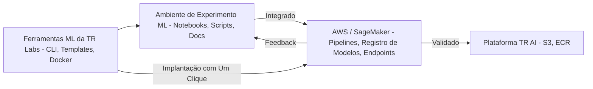

# Visão Geral de Operações de Machine Learning (MLOps)

**Lição 02**
Arquitetura de Soluções de IA por Faisal Nazir

## Sumário da Disciplina
A presente lição (02) aborda a "Visão Geral de Operações de Machine Learning (MLOps)". Outros tópicos no currículo incluem:
*   01: O Cenário de IA/ML
*   03: Dados & Engenharia de Dados
*   04: Conceitos de Machine Learning: Regressão
*   05: Conceitos de Machine Learning: Classificação & Clustering
*   06: Treinamento, Ajuste & Implantação de Modelos
*   07: Fundamentos de Deep Learning & Reinforcement Learning
*   08: Técnicas Avançadas de Deep Learning
*   09: IA Generativa: Conceitos & Uso Básico
*   10: IA Generativa: Engenharia de Prompt & Multi-Agentes de IA
*   11: Visualização & Aplicação
*   12: IA em Escala & Pipelines Avançados
*   13: O Estado da Arte em IA
*   14: IA Explicável (xAI)
*   15: Serviços de Nuvem para IA/ML
*   16: Tornando-se um Arquiteto de IA de Sucesso

## Agenda da Lição
1.  A necessidade de MLOps e por que uma abordagem simples de "lançamento de modelo" não é suficiente.
2.  Visão geral do pipeline de MLOps.
3.  Introdução ao GenAIOps e seus elementos de pipeline únicos.
4.  Estudo de Caso: Exemplos de projetos reais.
5.  Demonstração: Caminhada pelo pipeline de MLOps.

## Orientações (Housekeeping)
*   Use o recurso "Q&A" no Zoom* se quiser fazer uma pergunta.
*   Câmera ligada durante a lição.
*   Por favor, coloque-se no mudo para não interromper acidentalmente o instrutor.
*   Use o recurso 'Levantar a mão' no Zoom se quiser fazer uma pergunta.
*   Não se esqueça de abaixar a mão, depois de terminar.
*   \*Certifique-se de atualizar o Zoom para a versão mais recente para usar este recurso.

## MLOps: A Necessidade

### Nível Técnico
*   **Mantém os modelos funcionando de forma confiável** – Sem MLOps, os modelos frequentemente quebram quando os dados do mundo real mudam, como um sistema de detecção de fraude que pode parar de funcionar quando novos tipos de golpes surgem.
*   **Previne problemas de "funciona no meu laptop"** – Garante que os modelos que funcionam em desenvolvimento realmente funcionem quando implantados para atender clientes.
*   **Acompanha o que está acontecendo nos bastidores** – Monitora se os modelos estão fazendo boas previsões ou começando a desviar do curso.
*   **Gerencia a complexidade** – Lida com pipelines de dados, versões de modelos e infraestrutura para que as equipes não precisem reinventar a roda a cada vez.

### Nível Operacional
*   **Acelera a implantação de meses para dias** – Em vez de mover modelos manualmente para produção, pipelines automatizados podem implantar atualizações de forma rápida e segura.
*   **Reduz erros humanos** – Testes automatizados detectam problemas antes que cheguem aos clientes, em vez de depender de verificações manuais.
*   **Permite melhor trabalho em equipe** – Cientistas de dados, engenheiros e equipes de negócios podem colaborar usando ferramentas e processos compartilhados.
*   **Torna as atualizações gerenciáveis** – Reverter um modelo problemático se torna tão fácil quanto reverter código de software.

### Nível de Negócios
*   **Protege seu investimento em IA** – Sem MLOps, até 90% dos projetos de IA falham em atingir a produção, desperdiçando milhões em custos de desenvolvimento.
*   **Entrega valor de negócio mais rapidamente** – As empresas podem iterar e melhorar produtos de IA rapidamente para se manterem competitivas.
*   **Reduz riscos e responsabilidades** – O monitoramento adequado ajuda a detectar modelos tendenciosos ou falhos antes que prejudiquem clientes ou o negócio.
*   **Escala a IA em toda a organização** – Em vez de projetos isolados, as empresas podem implantar sistematicamente soluções de IA que realmente geram ROI.

### Conclusão
**MLOps é como ter controle de qualidade para IA** – garante que seus modelos funcionem de forma confiável, implantem rapidamente e entreguem valor de negócio real em vez de serem apenas experimentos caros.

## O Pipeline MLOps
MLOps é definido como uma sequência de etapas interconectadas, incluindo processos e preocupações transversais, conforme ilustrado abaixo.

```mermaid
graph TD
    subgraph Pipeline Principal MLOps
        BPA[Análise do Problema de Negócio] --> MS[Seleção do Modelo]
        DC[Coleta de Dados] --> DP[Preparação de Dados]
        DP --> FS(Feature Store)
        MS --> MT[Treinamento do Modelo]
        FS --> MT
        MT --> ME[Avaliação do Modelo]
        ME --> PC{Performance do Modelo Satisfatória?}
        PC -- SIM --> MD[Implantação do Modelo]
        PC -- NÃO --> MTUN[Ajuste do Modelo]
        MTUN --> MT
        MD --> MM[Monitoramento & Manutenção]
        MM --> IRN{Retreinamento Necessário?}
        IRN -- SIM --> DC
        IRN -- NÃO --> MM

        ME -- Armazena --> MR(Repositório de Modelos)
        MR -- Busca --> MD
    end

    subgraph Preocupações Transversais
        MSec[Segurança do Modelo] --- MComp[Conformidade do Modelo] --- MLC[Gerenciamento do Ciclo de Vida do Modelo] --- MEx[Explicabilidade do Modelo]
    end

    style BPA fill:#339933,stroke:#333,stroke-width:2px,color:#fff
    style MS fill:#339933,stroke:#333,stroke-width:2px,color:#fff
    style FS fill:#339933,stroke:#333,stroke-width:2px,color:#fff
    style MR fill:#339933,stroke:#333,stroke-width:2px,color:#fff

    style DC fill:#9933ff,stroke:#333,stroke-width:2px,color:#fff
    style DP fill:#9933ff,stroke:#333,stroke-width:2px,color:#fff
    style MT fill:#9933ff,stroke:#333,stroke-width:2px,color:#fff
    style ME fill:#9933ff,stroke:#333,stroke-width:2px,color:#fff
    style PC fill:#9933ff,stroke:#333,stroke-width:2px,color:#fff
    style MD fill:#9933ff,stroke:#333,stroke-width:2px,color:#fff
    style MM fill:#9933ff,stroke:#333,stroke-width:2px,color:#fff
    style IRN fill:#9933ff,stroke:#333,stroke-width:2px,color:#fff
    style MTUN fill:#9933ff,stroke:#333,stroke-width:2px,color:#fff
    style MSec fill:#9933ff,stroke:#333,stroke-width:2px,color:#fff
    style MComp fill:#9933ff,stroke:#333,stroke-width:2px,color:#fff
    style MLC fill:#9933ff,stroke:#333,stroke-width:2px,color:#fff
    style MEx fill:#9933ff,stroke:#333,stroke-width:2px,color:#fff
```

### Detalhamento das Etapas do Pipeline MLOps

#### Etapa de Coleta de Dados
*   **Propósito**: Coletar dados brutos de várias fontes para treinar e melhorar modelos de machine learning.
*   **Atividades Chave**:
    *   Identificação de fontes de dados relevantes (bancos de dados, APIs, arquivos, streams).
    *   Configuração de pipelines de ingestão de dados.
    *   Garantia da qualidade e completude dos dados.
    *   Gerenciamento da privacidade dos dados e requisitos de conformidade.
*   **Melhores Práticas**:
    *   Automatizar processos de coleta de dados.
    *   Implementar verificações de validação de dados.
    *   Monitorar o desvio e anomalias dos dados.
    *   Documentar as fontes de dados e a linhagem.

#### Análise do Problema de Negócio
*   **Propósito**: Definir e analisar o problema de negócio que o machine learning resolverá.
*   **Atividades Chave**:
    *   Definição e escopo do problema.
    *   Identificação de métricas de sucesso.
    *   Coleta de requisitos das partes interessadas.
    *   Avaliação de ROI e impacto.
*   **Considerações**:
    *   Viabilidade técnica.
    *   Disponibilidade e qualidade dos dados.
    *   Restrições de recursos e cronograma.
    *   Implicações regulatórias e éticas.

#### Preparação dos Dados para Análise e Treinamento do Modelo
*   **Propósito**: Limpar, transformar e preparar dados brutos para o treinamento do modelo de machine learning.
*   **Atividades Chave**:
    *   Limpeza de dados (tratamento de valores ausentes, outliers).
    *   Engenharia e seleção de características (feature engineering).
    *   Normalização e escalonamento de dados.
    *   Divisão em conjuntos de treinamento/validação/teste.
*   **Ferramentas e Tecnologias**:
    *   Pandas, NumPy para manipulação de dados.
    *   Apache Spark para processamento em larga escala.
    *   Feature stores para gerenciamento de características.
    *   Frameworks de validação de dados.

#### Feature Store (Armazenar Características Importantes)
*   **Propósito**: Repositório centralizado para armazenar, gerenciar e servir características de machine learning.
*   **Benefícios Chave**:
    *   Reusabilidade de características entre projetos.
    *   Definições consistentes de características.
    *   Corretude "point-in-time".
    *   Descoberta de características e rastreamento de linhagem.
*   **Componentes**:
    *   Cálculo e transformação de características.
    *   Armazenamento de características (online/offline).
    *   Serviço de características para inferência em tempo real.
    *   Monitoramento de características e verificações de qualidade.

#### Seleção do Modelo Correto / Abordagem
*   **Propósito**: Escolher o algoritmo e a abordagem de machine learning mais apropriados para o problema.
*   **Critérios de Seleção**:
    *   Tipo de problema (classificação, regressão, clustering).
    *   Características dos dados (tamanho, dimensionalidade, qualidade).
    *   Requisitos de desempenho.
    *   Necessidades de interpretabilidade.
*   **Categorias de Modelos**:
    *   ML Tradicional (SVM, Random Forest, XGBoost).
    *   Deep Learning (CNN, RNN, Transformers).
    *   Métodos de Ensemble.
    *   Algoritmos especializados para domínios específicos.

#### Treinamento do Modelo
*   **Propósito**: Treinar modelos de machine learning usando dados preparados e algoritmos selecionados.
*   **Atividades Chave**:
    *   Seleção de algoritmos e ajuste de hiperparâmetros.
    *   Validação cruzada e avaliação de modelos.
    *   Rastreamento de experimentos e controle de versão.
    *   Gerenciamento e otimização de recursos.
*   **Considerações de MLOps**:
    *   Pipelines de treinamento reprodutíveis.
    *   Otimização automatizada de hiperparâmetros.
    *   Treinamento distribuído para modelos grandes.
    *   Versionamento de modelos e gerenciamento de artefatos.

#### Avaliação do Treinamento Usando as Métricas Corretas
*   **Propósito**: Avaliar o desempenho do modelo usando várias métricas e técnicas de validação.
*   **Atividades Chave**:
    *   Cálculo de métricas de desempenho (acurácia, precisão, recall, F1-score).
    *   Comparação e seleção de modelos.
    *   Avaliação de viés e imparcialidade.
    *   Teste de robustez.
*   **Métodos de Avaliação**:
    *   Técnicas de validação cruzada.
    *   Frameworks de teste A/B.
    *   Teste de significância estatística.
    *   Análise de interpretabilidade de modelos.

#### Ponto de Decisão: Ajustar o Modelo ou Implantar
*   **Propósito**: Ponto de decisão para determinar se o modelo atende aos requisitos de desempenho para implantação.
*   **Critérios de Avaliação**:
    *   Métricas de acurácia vs. linha de base/requisitos de negócio.
    *   Requisitos de latência e throughput.
    *   Restrições de utilização de recursos.
    *   Avaliações de viés e imparcialidade.
*   **Resultados da Decisão**:
    *   **SIM**: Prosseguir para a implantação do modelo.
    *   **NÃO**: Retornar ao ajuste do modelo para otimização.

#### Ajustar o Modelo, se Necessário
*   **Propósito**: Otimizar o desempenho do modelo através do ajuste de hiperparâmetros e ajustes de arquitetura.
*   **Abordagens de Ajuste**:
    *   Grid search e random search.
    *   Otimização Bayesiana.
    *   Ajuste automatizado de hiperparâmetros.
    *   Busca de arquitetura neural.
*   **Alvos de Otimização**:
    *   Acurácia da previsão.
    *   Latência de inferência.
    *   Tamanho e complexidade do modelo.
    *   Eficiência de recursos.

#### Repositório de Modelos (Armazenar Modelos com Bom Desempenho)
*   **Propósito**: Sistema centralizado de armazenamento e gerenciamento para modelos de machine learning treinados.
*   **Características Chave**:
    *   Versionamento de modelos e rastreamento de linhagem.
    *   Metadados e documentação do modelo.
    *   Controle de acesso e permissões.
    *   Fluxos de trabalho de promoção de modelos.
*   **Gerenciamento do Ciclo de Vida do Modelo**:
    *   Ambientes de desenvolvimento, staging e produção.
    *   Processos de aprovação e governança de modelos.
    *   Capacidades de rollback.
    *   Rastreamento do desempenho do modelo.

#### Implantação do Modelo em Produção
*   **Propósito**: Implantar modelos treinados em ambientes de produção para inferência no mundo real.
*   **Estratégias de Implantação**:
    *   Implantações blue-green.
    *   Lançamentos canary.
    *   Implantações de teste A/B.
    *   Implantações em modo sombra.
*   **Considerações de Infraestrutura**:
    *   Containerização (Docker, Kubernetes).
    *   Capacidades de auto-escalonamento.
    *   Balanceamento de carga e tolerância a falhas.
    *   Controles de segurança e acesso.

#### Monitoramento e Manutenção do Modelo para Desempenho
*   **Propósito**: Monitorar continuamente o desempenho do modelo e manter a saúde do sistema em produção.
*   **Áreas de Monitoramento**:
    *   Métricas de desempenho do modelo.
    *   Qualidade e desvio dos dados (data drift).
    *   Desempenho do sistema (latência, throughput).
    *   Utilização de recursos.
*   **Atividades de Manutenção**:
    *   Gerenciamento de alertas e resposta a incidentes.
    *   Atualizações e patches de modelos.
    *   Dimensionamento e otimização de infraestrutura.
    *   Atualizações de segurança e conformidade.

#### Decidir Quando Retreinar o Modelo
*   **Propósito**: Ponto de decisão contínuo para determinar quando os modelos precisam ser retreinados.
*   **Gatilhos para Retreinamento**:
    *   Degradação do desempenho do modelo.
    *   Detecção de desvio de dados (data drift).
    *   Identificação de desvio de conceito (concept drift).
    *   Intervalos de retreinamento agendados.
*   **Resultados da Decisão**:
    *   **SIM**: Retornar à coleta/preparação de dados (loop).
    *   **NÃO**: Continuar monitorando sem retreinamento.

#### Segurança do Modelo
*   **Propósito**: Proteger modelos e sistemas de machine learning contra ameaças e vulnerabilidades de segurança.
*   **Preocupações de Segurança**:
    *   Ataques adversariais e manipulação de entrada.
    *   Roubo de modelos e propriedade intelectual.
    *   Vazamento de privacidade e exposição de dados.
    *   Segurança da cadeia de suprimentos.
*   **Medidas de Segurança**:
    *   Validação e sanitização de entrada.
    *   Criptografia de modelo e controles de acesso.
    *   Técnicas de treinamento adversarial.
    *   Monitoramento de segurança e detecção de ameaças.

#### Conformidade do Modelo
*   **Propósito**: Garantir que os modelos de machine learning estejam em conformidade com os requisitos regulatórios e padrões da indústria.
*   **Áreas de Conformidade**:
    *   Regulamentações de privacidade de dados (GDPR, CCPA).
    *   Padrões específicos da indústria (HIPAA, SOX).
    *   Diretrizes de ética e imparcialidade da IA.
    *   Requisitos de governança de modelos.
*   **Implementação**:
    *   Documentação e trilhas de auditoria.
    *   Testes de viés e avaliações de imparcialidade.
    *   Capacidades de direito à explicação.
    *   Rastreamento de linhagem e proveniência de dados.

#### Gerenciamento do Ciclo de Vida do Modelo
*   **Propósito**: Gerenciar todo o ciclo de vida dos modelos de machine learning, desde a concepção até a aposentadoria.
*   **Estágios do Ciclo de Vida**:
    *   Desenvolvimento e experimentação.
    *   Teste e validação.
    *   Implantação e produção.
    *   Monitoramento e manutenção.
    *   Aposentadoria e arquivamento.
*   **Atividades de Gerenciamento**:
    *   Controle de versão e gerenciamento de mudanças.
    *   Fluxos de trabalho de promoção de ambiente.
    *   Rastreamento e relatório de desempenho.
    *   Alocação e otimização de recursos.

#### Explicabilidade do Modelo
*   **Propósito**: Fornecer transparência e interpretabilidade para as decisões de modelos de machine learning.
*   **Técnicas de Explicabilidade**:
    *   Análise de importância de características (Feature importance analysis).
    *   Valores SHAP (Shapley Additive Explanations).
    *   LIME (Local Interpretable Model-agnostic Explanations).
    *   Mecanismos de atenção e mapas de saliência.
*   **Benefícios**:
    *   Construir confiança com as partes interessadas.
    *   Depurar e melhorar o desempenho do modelo.
    *   Atender aos requisitos regulatórios.
    *   Identificar potenciais vieses.

## Estudo de Caso: Thomson Reuters Labs - MLOps em Escala

### O Problema
*   Mais de 150 engenheiros de ML e cientistas de dados.
*   **Falta de padronização** – cada pesquisador construía modelos à sua maneira.
*   **Configuração manual para cada projeto** = enorme desperdício.
*   Projetos de pesquisa exigiam **reescritas completas para produção**.

### A Solução: Framework MLTOOLS
A solução envolveu a implementação de uma plataforma MLOps padronizada baseada em AWS com templates e automação, um código-base compartilhado entre pesquisadores e engenheiros, e implantação com um clique do desenvolvimento local para a produção no SageMaker.

A arquitetura da solução pode ser simplificadamente representada da seguinte forma:

### Resultados
*   Economia de **3-5 dias por pessoa por mês** em tarefas de infraestrutura.
*   Melhoria de **40% na produtividade** em todo o ciclo de vida do ML.
*   **Tempo de lançamento no mercado mais rápido** para inovações de IA.
*   **Maior satisfação da equipe** e retenção de talentos.
*   **Principal Conclusão**: Frameworks MLOps padronizados tornam-se essenciais quando as equipes de ML crescem **além de 20-30 pessoas** – o investimento se paga através da eliminação de desperdícios e iteração mais rápida.

## Demonstração
(Esta seção da apresentação não contém conteúdo textual ou gráfico para conversão, apenas um título indicando uma demonstração).

## Atribuição #02

### Projeto Mini Pipeline
*   Desenvolver um **mini pipeline de MLOps** para um conjunto de dados de exemplo, cobrindo pelo menos **limpeza de dados, engenharia de características, treinamento de modelo e uma estratégia de implantação simulada**.
*   Usar o **exemplo de código** fornecido no Notebook.
*   **Data de Entrega**: 27 de julho, 23:59 BST.
*   **Pontuação**: 5 pontos.

## Perguntas e Respostas (Q&A)
Encorajamos você a fazer perguntas, no entanto, **esteja atento ao seu tempo e ao tempo de seus colegas**. Mantenha suas perguntas curtas e concisas.

## Feedback
Você gostou da lição? Por favor, reserve um momento para completar uma breve pesquisa ao final desta sessão. Seu feedback nos ajudará a melhorar sua experiência de aprendizado.
